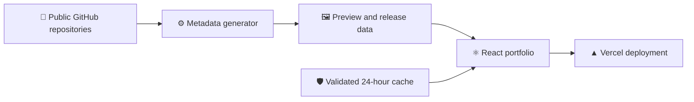

<div align="center">

<a href="https://kavisha.online">
  
</a>

# ✨ Kavisha Portfolio V2

### Software Engineering · Artificial Intelligence · Creative Development

A fast, accessible, and interactive portfolio built to showcase my projects, technical skills, education, and journey as a Software Engineering and AI undergraduate.

[](https://kavisha.online)
[](https://github.com/MacroMaster101/kavisha_portfolio-V2/actions/workflows/ci.yml)
[](https://github.com/MacroMaster101/kavisha_portfolio-V2/actions/workflows/social-previews.yml)

<br />


<br /><br />

**[Explore the portfolio →](https://kavisha.online)**

</div>

---

## 👋 About the Project

This repository contains the second version of my personal portfolio. It presents my featured work, broader GitHub project archive, technical skills, education, and internship profile through a responsive experience built for both personality and performance.

The site is designed and developed by **Kavisha Liyanage**, a third-year SLIIT undergraduate specializing in Artificial Intelligence.

## 🚀 Experience Highlights

- 🧠 Interactive neural-particle loader with mouse, touch, light-theme, and dark-theme support
- 🤖 Lazy-loaded interactive Spline robot with responsive framing and background-tab safeguards
- 🌓 System-aware first visit with a persistent light or dark theme preference
- 📱 Responsive navigation and layouts for phone, tablet, laptop, and desktop screens
- 🗂️ Live public GitHub project archive with useful multi-category filters
- ⭐ Five curated featured project stories with real preview artwork and technology stacks
- 🔄 Build-generated repository preview URLs, language data, and release metadata
- ♿ Semantic landmarks, keyboard navigation, reduced-motion support, and visible focus states
- 🔎 Canonical metadata, `WebSite` and `Person` structured data, sitemap, robots, and social cards
- 🔐 Restrictive production security headers, validated public data, and privacy-conscious analytics

## 🌟 Featured Work

| Project | What it demonstrates |
| --- | --- |
| 🎮 **Just For Fun** | Community platform, moderation tooling, and production deployment |
| 🌐 **Mazora Network** | Next.js community platform, live integrations, storefront, and staff administration |
| ✈️ **Travel Genie** | Full-stack AI-assisted travel planning for Sri Lanka |
| 📲 **Travel Genie App** | React Native travel companion with secure REST APIs |
| ✂️ **Vero Salon** | Full-stack salon booking, customer accounts, reviews, and staff workflows |

## 🧰 Technology Stack

| Area | Technologies |
| --- | --- |
| ⚛️ Interface | React 19, TypeScript 6, Tailwind CSS 4 |
| ⚡ Tooling | Vite 8, PostCSS, ESLint, TSX |
| 🎞️ Motion | Framer Motion, Canvas API, CSS animation |
| 🧊 3D experience | React Spline, Spline Runtime |
| 🐙 Project data | GitHub REST API, generated repository metadata, validated browser cache |
| ☁️ Deployment | Vercel, Vercel Analytics, GitHub Actions |
| 🧪 Quality | TypeScript strict mode, ESLint, Node test runner, npm audit |

## 🏗️ How It Works



The production bundle does not require GitHub access to render its core project content. Bundled fallback data keeps featured work available, while the browser can refresh public repository information and store a validated 24-hour cache.

## 💻 Local Development

### Requirements

- Node.js 20.19+, 22.13+, or 24+
- npm 11

### Installation

```bash
git clone https://github.com/MacroMaster101/kavisha_portfolio-V2.git
cd kavisha_portfolio-V2
npm ci
npm run dev
```

Open **[http://localhost:5173](http://localhost:5173)**.

### Commands

| Command | Purpose |
| --- | --- |
| `npm run dev` | Start the Vite development server |
| `npm run build` | Run TypeScript checks and create the production bundle |
| `npm run preview` | Preview the production bundle locally |
| `npm run lint` | Run ESLint across the repository |
| `npm test` | Run the GitHub data validation and cache tests |
| `npm run social-previews` | Refresh repository previews, languages, and release metadata |

## 🐙 Project Data

The portfolio never exposes a GitHub access token in client-side code.

- Only public repositories owned by `MacroMaster101` are accepted.
- API responses and cached values are validated before rendering.
- Private repositories, malformed URLs, expired caches, and unexpected owners are rejected.
- Bundled fallback data keeps the project section available during API outages or rate limits.
- The scheduled metadata workflow uses GitHub's repository-scoped built-in token.
- Partial metadata request failures preserve the last valid generated values.

An optional token can be used locally when regenerating metadata:

```env
GITHUB_TOKEN=your_optional_token
```

> [!CAUTION]
> Never place a secret in a `VITE_*` variable. Vite exposes referenced `VITE_*` values to browser JavaScript. Never commit a local `.env` file.

## 📁 Repository Structure

```text
.
├── .github/workflows/           CI and project-metadata automation
├── .env.example                 Optional build-only token template
├── public/                      Logo, portrait, résumé, SEO, and social assets
├── scripts/
│   └── fetch-social-previews.mjs
├── src/
│   ├── components/
│   │   ├── sections/           Portfolio content sections
│   │   └── ui/                 Navigation, loader, cursor, and visual components
│   ├── contexts/               Theme state and preference handling
│   ├── data/                   Generated repository metadata
│   ├── lib/                    GitHub validation, caching, and fetching
│   ├── pages/                  Main page composition
│   ├── App.tsx
│   └── main.tsx
├── tests/                      Automated public-data security tests
├── index.html                  SEO metadata and application entry
├── package.json                Commands and dependency manifest
└── vercel.json                 Redirects, security, and cache headers
```

## 🎨 Customization Guide

- 📝 Portfolio content: `src/components/sections/`
- ⭐ Featured projects and filters: `src/components/sections/Projects.tsx`
- 🧠 Neural loading experience: `src/components/ui/Loader.tsx`
- 🎨 Brand colors and global styles: `src/index.css`
- 🖼️ Logo and social artwork: `public/Logo.png` and `public/og-image.jpg`
- 🤖 Spline scene and responsive robot framing: `src/components/sections/Hero.tsx`

## 🔐 Privacy & Security

- No authentication, database, admin panel, tracking cookies, or contact-form backend
- Theme preference and validated public GitHub data are the only persistent browser data
- CSP, HSTS, referrer, permissions, framing, and MIME-sniffing protections
- Permanent `www` → canonical-domain redirect
- No browser-side secrets or private repository access
- External links use safe new-tab behavior

## ☁️ Deployment

The project is ready for Vercel:

| Setting | Value |
| --- | --- |
| Framework | Vite |
| Build command | `npm run build` |
| Output directory | `dist` |
| Required production secrets | None |

The included `vercel.json` configures canonical host redirects, security headers, and long-lived caching for hashed production assets.

## ✅ Release Checklist

```bash
npm run lint
npm test
npm run build
npm audit
```

The repository also runs these checks automatically for pushes and pull requests through GitHub Actions.

## 🤝 Connect

- 🌐 Portfolio: [kavisha.online](https://kavisha.online)
- 🐙 GitHub: [@MacroMaster101](https://github.com/MacroMaster101)
- 💼 LinkedIn: [Kavisha Liyanage](https://www.linkedin.com/in/kavisha-liyanage04/)
- ✉️ Email: [lakshan.kavishatt@gmail.com](mailto:lakshan.kavishatt@gmail.com)

## 📄 Usage

This repository is publicly visible for portfolio and demonstration purposes. No standalone license is currently included, so reuse rights are not granted by default. Personal biography, photographs, résumé content, and project descriptions remain personal material.

---

<div align="center">

### Built with curiosity, code, and a little purple energy 💜

Designed and developed by **Kavisha Liyanage**

⭐ If you enjoy the project, consider giving the repository a star.

</div>
