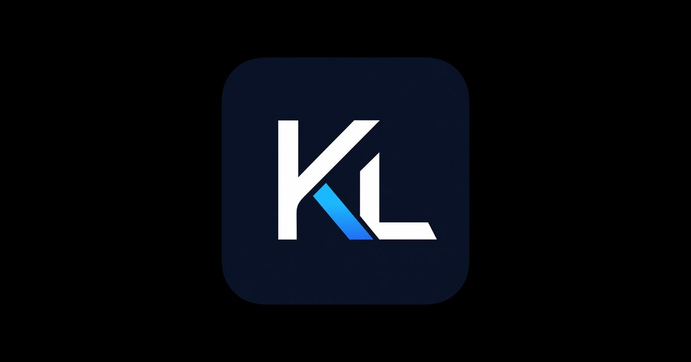
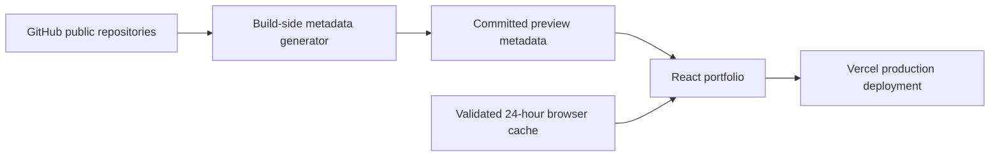

<div align="center">



# ✨ Kavisha Portfolio V2

### Software Engineering · Artificial Intelligence · Creative Development

A fast, accessible, and interactive portfolio showcasing my projects, technical skills, education, and journey as a Software Engineering and AI undergraduate.

[](https://kavisha.online)
[](https://github.com/MacroMaster101/kavisha_portfolio-V2/actions/workflows/social-previews.yml)
[](https://github.com/MacroMaster101/kavisha_portfolio-V2)

<br />


</div>

---

## 🌐 Live Portfolio

Visit **[kavisha.online](https://kavisha.online)** to explore the full interactive experience.

The site includes a particle-based `KL` welcome screen, touch and mouse interaction, a cloud-and-scatter portfolio reveal, a responsive 3D Spline robot, and a validated public GitHub project showcase.

## 🚀 Highlights

- ✨ Interactive particle intro with an accessible **Get Started** experience
- ☁️ Theme-matched aurora clouds, network graphics, and blended page reveal
- 🤖 Lazy-loaded interactive Spline robot with background-tab safeguards
- 🌓 System-aware light and dark themes with persisted preference
- 📱 Responsive layouts and navigation for mobile, tablet, and desktop
- 🧑‍💻 Public GitHub project feed with strict runtime validation and caching
- 🖼️ Build-generated repository previews, languages, and release information
- ♿ Skip navigation, keyboard focus management, semantic landmarks, and reduced-motion support
- 🔍 Open Graph, Twitter Card, Person JSON-LD, sitemap, and robots metadata
- 🔐 Content Security Policy, HSTS, privacy-conscious storage, and secure external links
- 📊 Privacy-conscious Vercel Analytics integration

## 🧰 Technology Stack

| Area | Technologies |
| --- | --- |
| ⚛️ Interface | React 19, TypeScript 6, Tailwind CSS 4 |
| ⚡ Tooling | Vite 8, ESLint 10, TSX |
| 🎞️ Motion | Framer Motion, Canvas particles, CSS animation |
| 🧊 3D Experience | Spline Runtime, React Spline |
| 🐙 Project Data | GitHub REST API, generated social previews, validated browser cache |
| ☁️ Hosting | Vercel, Vercel Analytics |
| 🧪 Quality | Node test runner, TypeScript build checks, ESLint, npm audit |

<div align="center">


</div>

## 🏗️ How It Works



The production build is deterministic and does not need network access. Repository preview metadata is generated ahead of time and committed, while the browser performs at most one unauthenticated GitHub repository-list request when its validated 24-hour cache is empty.

## 🧑‍💻 Local Development

### Requirements

- Node.js 20 or newer
- npm

### Setup

```bash
git clone https://github.com/MacroMaster101/kavisha_portfolio-V2.git
cd kavisha_portfolio-V2
npm ci
npm run dev
```

Open **[http://localhost:5173](http://localhost:5173)**.

### Commands

| Command | Purpose |
| --- | --- |
| `npm run dev` | Start the Vite development server |
| `npm run build` | Run TypeScript checks and create the production build |
| `npm run preview` | Preview the production bundle locally |
| `npm run lint` | Run ESLint across the project |
| `npm test` | Run the GitHub validation and cache tests |
| `npm run social-previews` | Refresh generated repository metadata |

## 🐙 GitHub Project Feed

The portfolio deliberately avoids shipping a GitHub token to the browser.

- Browser requests are unauthenticated and limited to public repository data.
- Repository objects and cached values are validated before use.
- Corrupt, expired, future-dated, private, and wrong-owner data is rejected.
- Language, release, and social-preview requests run only in the build-side generator.
- Bundled metadata keeps the portfolio usable if GitHub is unavailable.

For optional higher generator rate limits, create a local `.env` file:

```env
GITHUB_TOKEN=your_optional_token
```

> [!IMPORTANT]
> Never use `VITE_GITHUB_TOKEN` or another `VITE_*` variable for secrets. Referenced Vite variables are exposed to browser JavaScript. Never commit `.env`.

The scheduled **Refresh social previews** GitHub Action uses GitHub's repository-scoped built-in token. No custom repository secret is required.

## 📁 Project Structure

```text
public/                         Static images, resume, SEO files, and social image
scripts/fetch-social-previews.mjs
src/
├── components/
│   ├── sections/              Portfolio content sections
│   └── ui/                    Navigation, loader, cursor, and visual components
├── contexts/                  Theme state and preference handling
├── data/socialPreviews.ts     Generated public repository metadata
├── lib/github.ts              GitHub validation, cache, and fetch logic
├── pages/Portfolio.tsx        Main page composition
└── App.tsx                    Intro lifecycle and application providers
tests/github.test.ts           GitHub data and cache security tests
vercel.json                    Security headers and asset caching
```

## 🎨 Customization

- Update portfolio content inside `src/components/sections/`.
- Adjust featured repositories and stack overrides in `Projects.tsx`.
- Add intentional project artwork to `public/projects/` and map it through `LOCAL_IMAGE_OVERRIDES`.
- Change theme colors through the brand variables in `src/index.css`.
- Replace the Spline scene URL in `Hero.tsx` after publishing a new scene.

## ☁️ Deployment

The project is configured for Vercel:

| Setting | Value |
| --- | --- |
| Build command | `npm run build` |
| Output directory | `dist` |
| Framework | Vite |
| Required production secrets | None |

`vercel.json` provides security headers and immutable caching for hashed assets. Unknown URLs retain genuine 404 behavior instead of being rewritten into soft-404 pages.

## 🔐 Privacy & Security

The site has no authentication, database, admin panel, tracking cookies, or contact-form backend. Contact uses a direct `mailto:` link.

Local browser storage is limited to:

- Theme preference
- One-session intro state
- One-time theme hint state
- Validated public GitHub repository cache

Browser requests may reach GitHub, Spline, Google Fonts, jsDelivr/Simple Icons, and Vercel Analytics.

## ✅ Quality Checks

Before publishing:

```bash
npm run lint
npm test
npm run build
npm audit
```

The current release passes all automated tests and reports zero dependency vulnerabilities.

## 🤝 Connect

- 🌐 Portfolio: [kavisha.online](https://kavisha.online)
- 🐙 GitHub: [@MacroMaster101](https://github.com/MacroMaster101)
- 💼 LinkedIn: [Kavisha Liyanage](https://www.linkedin.com/in/kavisha-liyanage04/)
- ✉️ Email: [lakshan.kavishatt@gmail.com](mailto:lakshan.kavishatt@gmail.com)

## 📄 Usage

This public repository is provided for portfolio and demonstration purposes. No standalone license is currently included, so reuse permission is not granted by default. Personal biography, photographs, resume content, and project descriptions remain personal material.

---

<div align="center">

Designed and built with 💜 by **Kavisha Liyanage**

⭐ If you like the project, consider giving the repository a star!

</div>
